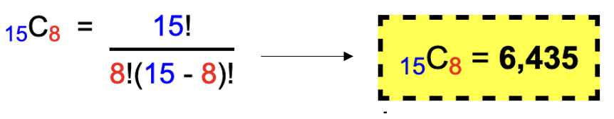
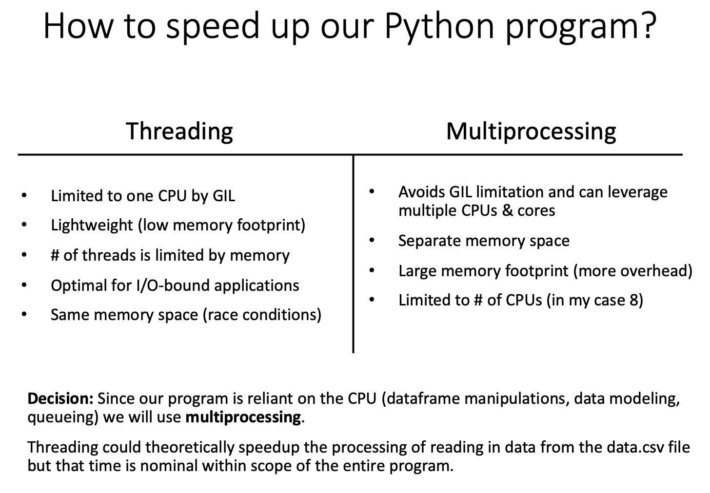
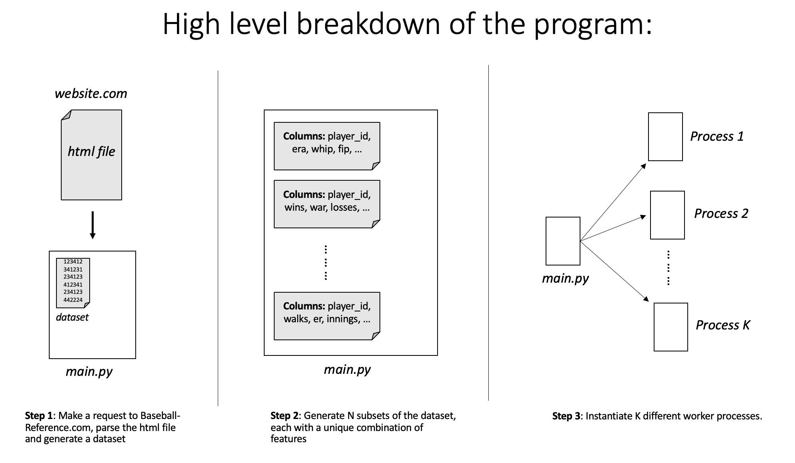
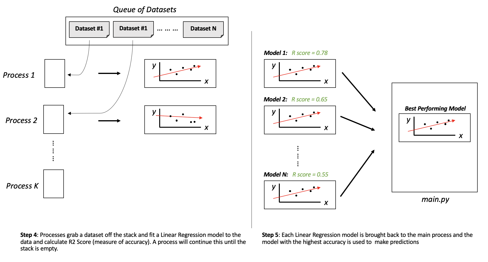
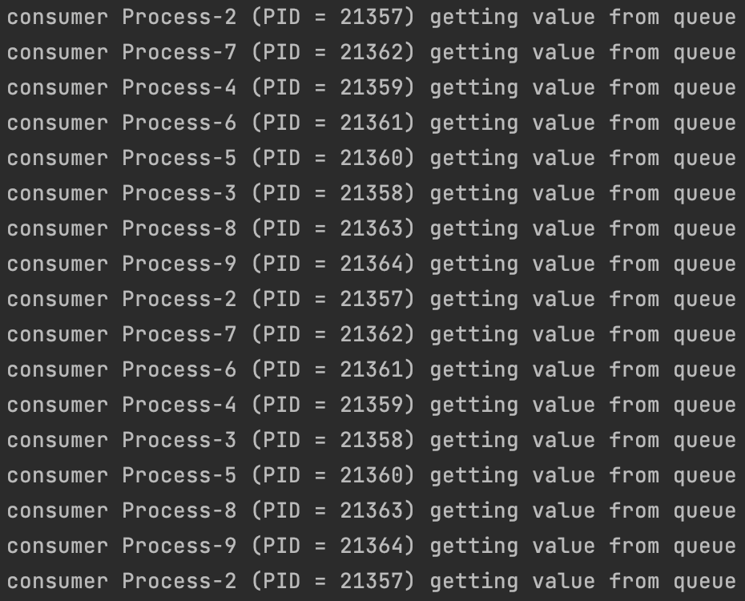
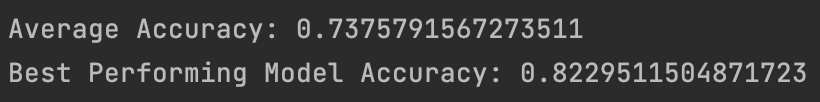
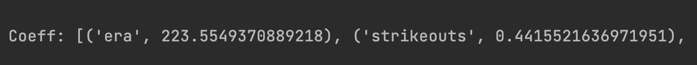
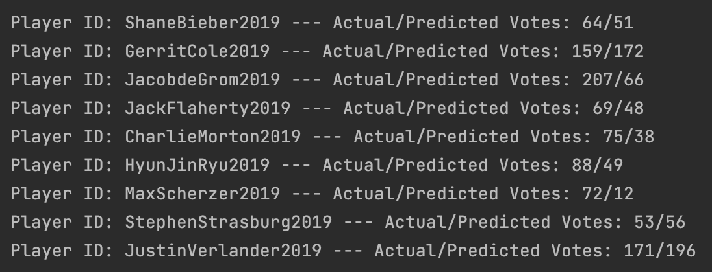

# Predicting 2021 Cy Young Awards

<h3 align="left">Goals:</h3>

__Non-technical:__ What pitching statistics are the best predictors
for who wins the Cy Young.

__Technical:__ Given a dataset (such as the one below), 
what combination of features generates a Linear Regression model with the highest accuracy (in terms of R2 Score).


----

<h3 align="left">Tasks to accomplish goals:</h3>

* Generate a dataset
* Generate a subset of the dataset
* Fit each subset to a linear regression model
* Calculate accuracy (R2 Score) of each model
* Choose the model with the highest score

<h3 align="left">The issue we face:</h3>

Let's say our dataset has __15__ variables, and we want to generate all combinations of __8__



This means we will have __6,435__ subsets of the dataset. This will require
extensive runtime to compute.

----



----




## Running the Program:

To run the program locally, execute the following lines into terminal:

```sh
$ git clone https://github.com/JackMentch/cy_young_regression.git
$ cd cy_young_regression
$ python -m venv cy_young_regression
$ pip install -r requirements.txt
```

Once the program is ready you can then run
```sh
$ python main.py
```

## File Overview:

__generate_dataset.py__: Parses baseball-reference.com and generates a .csv that contains the training/testing data for modeling

__testing_dataset.py__: Parses baseball-reference.com and generates a .csv that contains the data used for making predictions 
once the optimal model is found

__model.py__: Every linear regression model is stored as a model object. This file defines the object's attributes/methods

__optimal_model.py__: Since most players do not receive any Cy Young votes, this script finds the optimal number
of players to remove that have 0 votes. This ensures our dataset isn't biased by players with 0 votes. 

__filtering.py__: Used in junction with optimal_model.py, this script does the removing of data.

## Results:

When you run the program, the first thing you will notice are the running Processes. Notice that once a Process is finished
with its dataset, it will grab the next one off of the queue until the stack is empty.



The next thing to notice is the average accuracy of all the models as well as the model with the highest accuracy. 
The model with highest accuracy is chosen to preform predictions with.



Before predictions are calculated, the coefficients of the best preforming model are printed. Notice that 
the greater the number, the more weight the variable has. The sign of the coefficient indicates the correlation.



Finally predictions are made with the best performing model. 



## Future Work to Improve Model:
- Normalize the dataset that we feed to the algorithm
  

- Cy Young votes are based on what league you play in. 
  In theory, a pitcher could be in the 90th percentile
  in MLB but be in the 99th percentile of the National/American League.
  Votes are dependent on a pitcher's respective league competition. The model should account for this.
  

- Regression Splines - Since the model is linear, players in the bottom percentile can receive negative
Cy Young votes. Regression spline can ensure more accurate estimations for players in any percentile.


## Credits:
- Baseball-Reference.com for generating the dataset
- Sklearn for the linear regression toolkit
