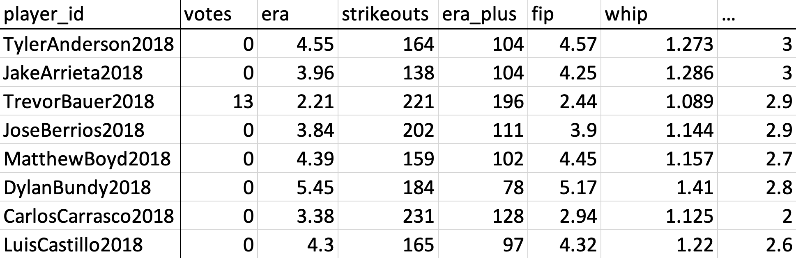
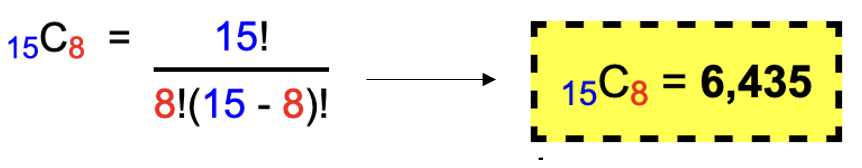

# Predicting 2021 Cy Young Awards

<h3 align="left">Goals:</h3>

__Non-technical:__ What pitching statistics are the best predictors
for who wins the Cy Young.

__Technical:__ Given a dataset (such as the one below), 
what combination of features generates a Linear Regression model with the highest accuracy (in terms of R2 Score).

----

<h3 align="left">Tasks to accomplish goals:</h3>

* Generate a dataset
* Generate a subset of the dataset
* Fit each subset to a linear regression model
* Calculate accuracy (R2 Score) of each model
* Choose the model with the highest score

<h3 align="left">The issue we face:</h3>

Let's say our dataset has __15__ variables, and we want to generate all combinations of __8__

## Independent Variables:
* __Batting Average Against__ _(baa)_
* __On-base Plus Slugging__ _(ops)_
* __Strikeout Percentage__ _(strkpct)_
* __Walk Percentage__ _(bbpct)_
* __Win Probability Added by Pitcher__ _(wpa)_
* __Base-Outs Runs Saved__ _(bors)_
* __Earned Run Average__ _(era)_
* __Strikeouts__ _(strikeouts)_
* __Earned Run Average Plus__ _(era_plus)_
* __Fielding Independent Pitching__ _(fip)_
* __Walks Hits per Innings Pitched__ _(whip)_
* __Walks per 9 innings__ _(bb_per_nine)_
* __Strikeouts per 9 innings__ _(strikeouts_per_nine)_

## Future Work to Improve Model:
- Normalize the dataset that we feed to the algorithm
  

- Cy Young votes are based on what league you play in. 
  In theory, a pitcher could be in the 90th percentile
  in MLB but be in the 99th percentile of the National/American League.
  Votes are dependent on a pitcher's respective league competition. The model should account for this.
  

- Regression Splines - Since the model is linear, players in the bottom percentile can receive negative
Cy Young votes. Regression spline can ensure more accurate estimations for players in any percentile.

## Credits:
- Baseball-Reference.com for generating the dataset
- Sklearn for the linear regression toolkit
